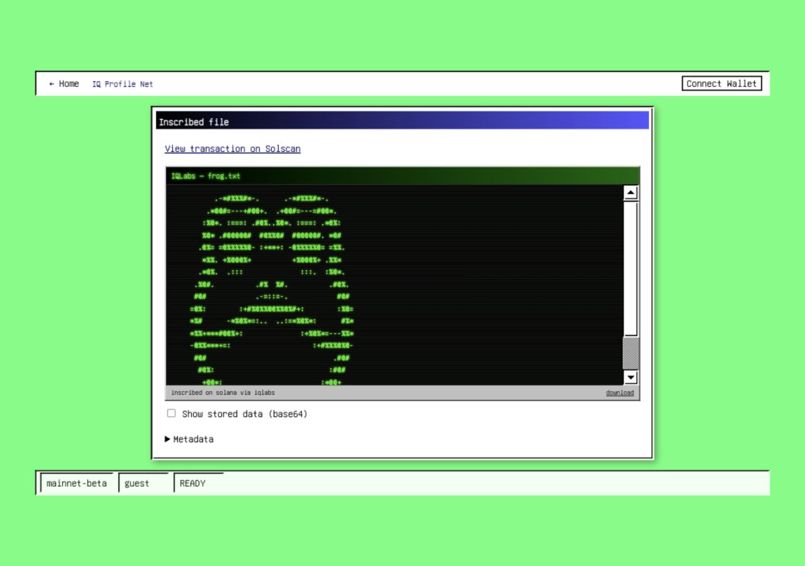
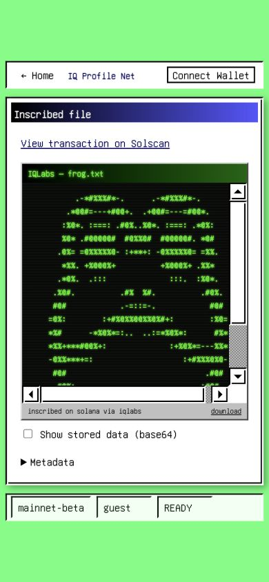

# Transaction viewer validation

Base: `7ccc26d`. Local, read-only tests; no inscriptions or wallet transactions were submitted.

- `npm test` on Node 24: 10 regression cases passed, including live gateway FROG data, Korean UTF-8, malformed metadata, HTML/SVG text, binary, empty and ambiguous base64-looking text.
- `npx tsc --noEmit`, changed-file ESLint, and `npm run build`: passed.
- Real FROG `frog.txt` and `deploy.json`: browser-rendered from the live gateway.
- Desktop 1280×900 and mobile 390×844 screenshots: no document overflow; ASCII retains spacing within its scrollable preview.
- Stored-data toggle and keyboard scrolling: verified.
- Chrome download: `frog.txt`, 802 bytes, exact match to decoded gateway response.
- Error/empty/raster-image states are implemented but do not yet have separate live browser fixtures in this evidence set.

The missing optional peer lock entries have been repaired. Clean `npm ci --ignore-scripts` succeeds using the committed lockfile. Tests use the `tsx` loader so the command also works on the Docker-declared Node 20 runtime. The earlier Node 24 screenshot/download receipts above remain historical; this follow-up adds Node 20 test coverage.

